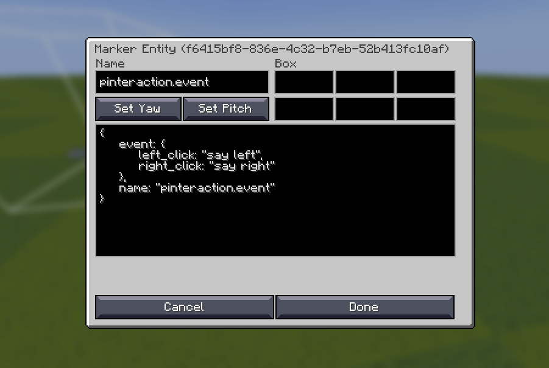

# 🖱 Pinteraction - interaction entity manager


`Pinteraction` is a minecraft datapack that allows you to easily edit the commands to be executed when interacting on an interaction entity.

It is more convenient to use with [Axiom](https://axiom.moulberry.com/).

## Installation

Download the file that matches Minecraft version from the [Releases page](https://github.com/minkyet/Pinteraction/releases).

## Usage

### pinteraction:summon

Summons an pinteraction(interaction entity) at your current location.
A Marker entity is created as a passenger of the pinteraction.

When used with the Axiom mod, you can right-click the Marker Gizmo to edit the event field inside the marker data.

`event` compound inside data is defined as:

```js
event: {
    left_click?: string,
    right_click?: string
}
```



### pinteraction:summon_with

Summons an interaction entity and sets its event or NBT.

> [!WARNING]
> `Tags` cannot be changed in NBT. If you want to change `Tags`, you must modify them separately after summoning.

**Examples**
```mcfunction
/function pinteraction:summon_with {options:{nbt:{width:0.5f, height:1.5f}, event:{right_click:"give @s apple", left_click:"give @s carrot"}}}
```

### pinteraction:set_event

Set event on an existing pinteraction entity.
This function must be executed with the pinteraction as the executor (as).
Use this when not using Axiom to manually set the event.

**Examples**
```mcfunction
/execute as @n[type=minecraft:interaction] run function pinteraction:set_event {event:{right_click: "kill @s"}}
```

### pinteraction:init

Converts a normal interaction entity into a pinteraction.
Run this function with the interaction entity as the executor (as).

**Examples**
```mcfunction
/execute as @n[type=minecraft:interaction] run function pinteraction:init
```

### pinteraction:init_with_event

Same as `pinteraction:init`, but also sets an event at the same time.
Run with the interaction entity as the executor (as).

**Examples**
```mcfunction
/execute as @n[type=minecraft:interaction] run function pinteraction:init_with_event {event:{right_click: "kill @s", left_click:"tp @s ~ ~10 ~"}}
```